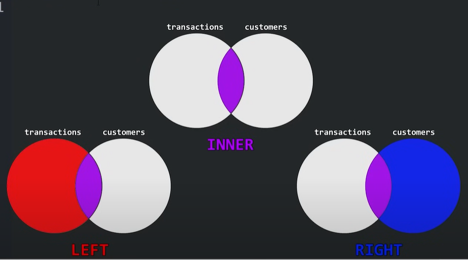
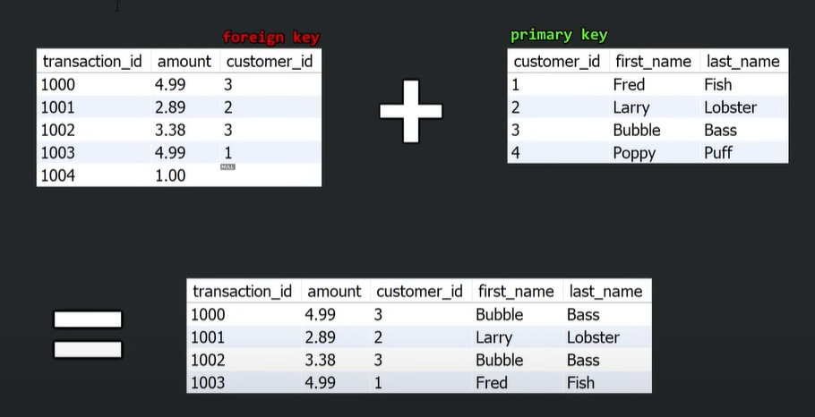
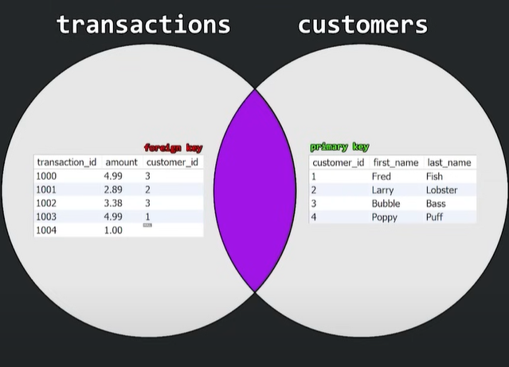

# SQL Constraints: AUTO_INCREMENT JOINS FUNCTIONS AND, OR, NOT WILDCARDS

### **1. AUTO_INCREMENT**
The `AUTO_INCREMENT` attribute automatically increases the value of a column (usually a primary key) by 1 for each new row.

#### **Modification to Table**
```sql
CREATE TABLE employees (
    employee_id INT AUTO_INCREMENT PRIMARY KEY,
    first_name VARCHAR(50),
    last_name VARCHAR(50),
    hourly_pay DECIMAL(5,2),
    hire_date DATE
);
```

#### **Example Insert**
```sql
INSERT INTO employees (first_name, last_name, hourly_pay, hire_date) 
VALUES ('John', 'Doe', 25.50, '2024-03-01');
```
👉 The `employee_id` will be automatically assigned (e.g., `1` for the first entry, `2` for the second, etc.).
```sql
ALTER TABLE employee_id
AUTO_INCREMENT = 1000;

DELETE FROM employees; --it will delete/drop all the ROWS. but it has the structure/schemas.
SELECT * FROM employees;
INSERT INTO employees
VALUES ('John', 'Doe', 25.50, '2024-03-01');
```
👉 The `employee_id` will be automatically assigned (e.g., `1000` for the first entry, `1001` for the second, etc.).
---

### **2. JOINS**
A `JOIN` combines data from multiple tables based on a related column.




#### **Example: Creating Another Table**
```sql
CREATE TABLE departments (
    department_id INT AUTO_INCREMENT PRIMARY KEY,
    department_name VARCHAR(50)
);

CREATE TABLE employee_department (
    employee_id INT,
    department_id INT,
    FOREIGN KEY (employee_id) REFERENCES employees(employee_id),
    FOREIGN KEY (department_id) REFERENCES departments(department_id)
);
```

#### **INNER JOIN Example**
Retrieve employees along with their department names:
```sql
SELECT e.employee_id, e.first_name, e.last_name, d.department_name
FROM employees e
JOIN employee_department ed ON e.employee_id = ed.employee_id
JOIN departments d ON ed.department_id = d.department_id;
```

---

### **3. FUNCTIONS**
SQL functions are built-in methods for calculations, date manipulations, etc.

#### **Example Queries**
1️⃣ **Calculate average pay:**
```sql
SELECT AVG(hourly_pay) AS avg_pay FROM employees;
```
2️⃣ **Find the highest hourly pay:**
```sql
SELECT MAX(hourly_pay) AS highest_pay FROM employees;
```
3️⃣ **Get employees hired in 2023:**
```sql
SELECT * FROM employees WHERE YEAR(hire_date) = 2023;
```

---

### **4. AND, OR, NOT**
These logical operators filter data based on multiple conditions.

#### **Examples**
1️⃣ **Find employees with hourly pay between $20 and $30:**
```sql
SELECT * FROM employees 
WHERE hourly_pay >= 20 AND hourly_pay <= 30;
```
2️⃣ **Find employees named ‘John’ or earning more than $50/hour:**
```sql
SELECT * FROM employees 
WHERE first_name = 'John' OR hourly_pay > 50;
```
3️⃣ **Find employees NOT hired in 2024:**
```sql
SELECT * FROM employees 
WHERE NOT YEAR(hire_date) = 2024;
```

---

### **5. WILDCARDS**
Wildcards (`%` and `_`) are used in `LIKE` queries for pattern matching.

#### **Examples**
1️⃣ **Find employees whose first name starts with ‘J’:**
```sql
SELECT * FROM employees WHERE first_name LIKE 'J%';
```
2️⃣ **Find employees whose last name has ‘son’ anywhere:**
```sql
SELECT * FROM employees WHERE last_name LIKE '%son%';
```
3️⃣ **Find employees whose first name is exactly 5 letters long:**
```sql
SELECT * FROM employees WHERE first_name LIKE '_____';
```

---
