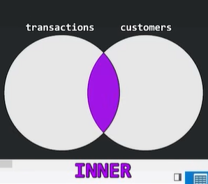
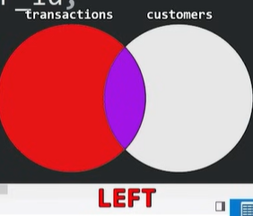
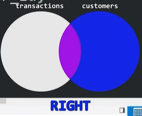

# SQL Joins Explained

In **SQL**, a **JOIN** is a way to combine data from two or more tables based on a related column between them. When you have data spread across multiple tables, you can use JOINs to retrieve the information you need in a single query.
# Simply, JOINS is used to combine rows from two or more tables based on a related column between them - such as a FOREIGN KEY -customer_id.

## Why Use JOIN?
Imagine you have two tables:

Customers: Stores customer details.
Orders: Stores order details made by customers.
Each table has a related column (e.g., customer_id in the Orders table matches id in the Customers table). To get information from both tables, you can use a JOIN to combine them based on this relationship.

## Tables Overview

### Transactions Table
| transaction_id | amount | customer_id |
|---------------|--------|-------------|
| 1000         | 4.99   | 3           |
| 1001         | 2.89   | 2           |
| 1002         | 3.38   | 3           |
| 1003         | 4.99   | 1           |
| 1004         | 1.00   | NULL        |

### Customers Table
| customer_id | first_name | last_name |
|------------|------------|-----------|
| 1          | Fred       | Fish      |
| 2          | Larry      | Lobster   |
| 3          | Bubble     | Bass      |
| 4          | Poppy      | Puff      |

```sql
-- Creating Customers table
CREATE TABLE Customers (
    customer_id INT PRIMARY KEY,
    first_name VARCHAR(50),
    last_name VARCHAR(50)
);

-- Creating Transactions table
CREATE TABLE Transactions (
    transaction_id INT PRIMARY KEY,
    amount DECIMAL(10, 2),
    customer_id INT,
    FOREIGN KEY (customer_id) REFERENCES Customers(customer_id) ON DELETE SET NULL
);
```
---

## SQL Joins

### 1. INNER JOIN
    This type of join returns only the rows where there is a match in both tables.

# Example Use Case: If you are joining two tables, customers and transactions, an INNER JOIN will return only the customers who have made transactions (matching records in both tables).

# Result: Only records where there is data in both the customers and transactions tables will appear in the result.

```sql
SELECT t.transaction_id, t.amount, c.first_name, c.last_name
FROM transactions t
INNER JOIN customers c ON t.customer_id = c.customer_id;

SELECT *
FROM transactions INNER JOIN customers
ON transactions.customer_id = customers.customer_id;

SELECT customers.name, transactions.amount
FROM customers
INNER JOIN transactions
ON customers.id = transactions.customer_id;
```

### 2. LEFT JOIN
    This join returns all the rows from the left table (the first table listed) and the matching rows from the right table (the second table). If there is no match, the result is NULL on the right side.

# Example Use Case: If you want to find all transactions, but even if some customers haven’t made any transactions, they should still appear in the result, with NULL for the transaction details.
# Result: All records from the left table, and matching records from the right table; non-matching rows will have NULL for columns from the right table.

```sql
SELECT t.transaction_id, t.amount, c.first_name, c.last_name
FROM transactions t
LEFT JOIN customers c ON t.customer_id = c.customer_id;

SELECT customers.name, transactions.amount
FROM customers
LEFT JOIN transactions
ON customers.id = transactions.customer_id;
```

### 3. RIGHT JOIN
    This join returns all the rows from the right table (the second table listed) and the matching rows from the left table (the first table). If there is no match, the result is NULL on the left side.

# Example Use Case: If you want to find all customers, but you still want to show customers even if they have no transactions, the RIGHT JOIN will ensure that all customer records appear, with NULL for transactions if none exist.

# All records from the right table, and matching records from the left table; non-matching rows will have NULL for columns from the left table.

```sql
SELECT t.transaction_id, t.amount, c.first_name, c.last_name
FROM transactions t
RIGHT JOIN customers c ON t.customer_id = c.customer_id;

SELECT customers.name, transactions.amount
FROM customers
RIGHT JOIN transactions
ON customers.id = transactions.customer_id;
```
---

**Visualization**  




---

### Summary

- **INNER JOIN**: Only matching records.
- **LEFT JOIN**: All transactions, even without customers.
- **RIGHT JOIN**: All customers, even without transactions.

