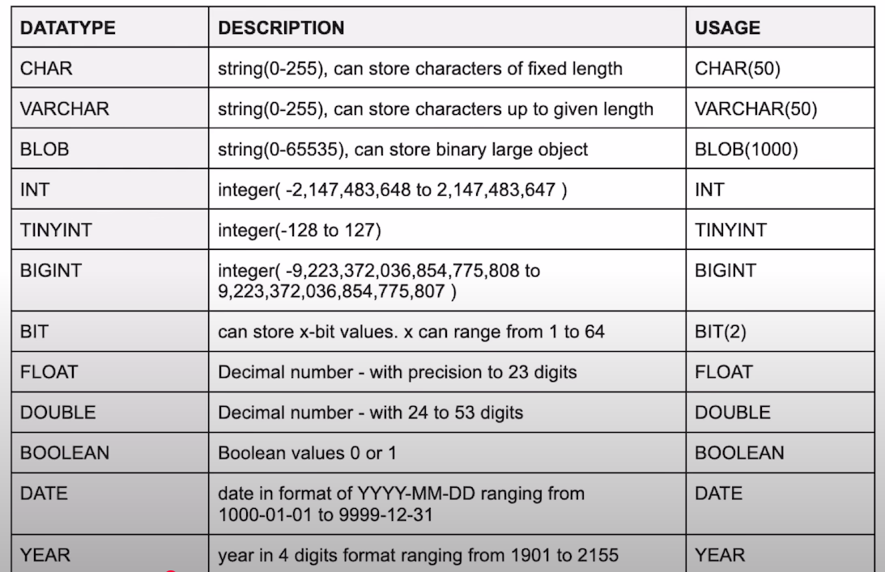

# Type of values that can be stored in a COLUMN.

For String:
----------------
CHAR (0-255)
VARCHAR (0-255)
BLOB

For Number:
------------------
INT
TINYINT
BIGINT
------------------
BIT
FLOAT
BOOLEAN
DATE
TIME
YEAR

# Signed and Unsigned
----------------------
INT UNSIGNED (0 to 255)
INT (-128 to 127)   >> this is Signed. where we have +ve and -ve both values.

# SQL Commands
Different types of SQL commands categorized into:

1. DDL (Data Definition Language) – Commands like CREATE, ALTER, RENAME, TRUNCATE, and DROP to define and modify database structures.
2. DQL (Data Query Language) – Contains only the SELECT statement, used for retrieving data.
3. DML (Data Manipulation Language) – Includes INSERT, UPDATE, and DELETE for modifying data.
4. DCL (Data Control Language) – Commands like GRANT and REVOKE for managing user permissions.
5. TCL (Transaction Control Language) – Commands such as START TRANSACTION, COMMIT, and ROLLBACK to manage transactions.

