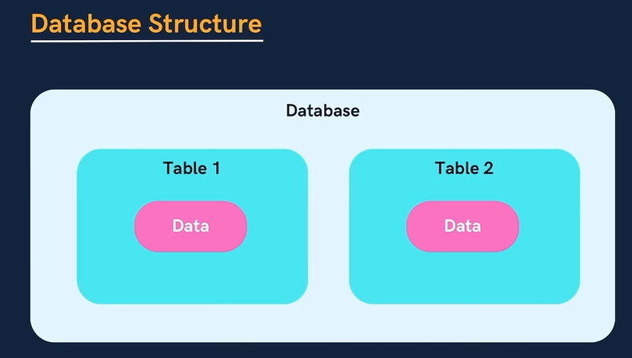
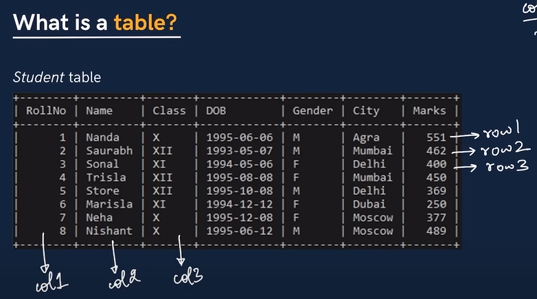
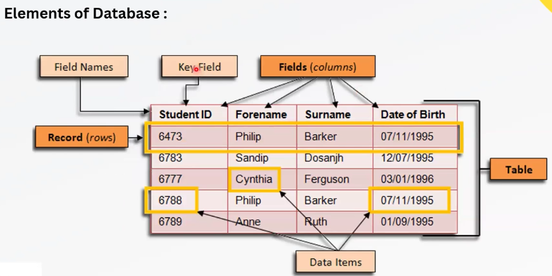

 

Database have tables, and tables have interrelated Data.

# Real-World Example:

Imagine a database for a school.
Table 1 could store student details (ID, Name, Age, Grade).
Table 2 could store course details (Course ID, Course Name, Instructor).
These tables can be related using keys (like Student ID).

We can also have a company database that includes employees, salaries, and departments, but it wouldn't contain course names. Generally, a database stores interrelated data in the form of tables.

A database is designed to store interrelated data in the form of tables. Each table contains specific information, and relationships between them ensure organized data retrieval.

# Example: Company Database
A company database typically consists of multiple tables, each serving a specific purpose. Here’s how it might be structured:

# Employees Table
Stores details of employees.
Columns: Employee_ID, Name, Age, Department_ID, Salary_ID

# Departments Table
Stores information about different departments in the company.
Columns: Department_ID, Department_Name, Manager_ID
# Salaries Table
Stores salary details of employees.
Columns: Salary_ID, Employee_ID, Base_Salary, Bonus

# Interrelationships Between Tables:
The Employees Table has a Department_ID column, which links to the Departments Table (Foreign Key).
The Employees Table also has a Salary_ID column, which links to the Salaries Table.
The Departments Table can have a Manager_ID, which references an employee.

# What is table?

 Table: `users`

| **ID** | **Name**   | **Age** | **Email**              | **Country** |     
|--------|------------|---------|------------------------|-------------|
| 1      | John Doe   | 28      | john.doe@example.com    | USA        |  row1
| 2      | Jane Smith | 34      | jane.smith@example.com  | UK         |  row2
| 3      | Bob Brown  | 45      | bob.brown@example.com   | Canada     |
| 4      | Alice Green| 29      | alice.green@example.com | Australia  |
 column1   column2 

This represents a table named users with columns (ID, Name, Age, Email, Country) and corresponding rows.

So, tables are combination of rows and columns.
One row is stored equal to One user's data. It represent indivisual user's information/data. It called records.
Column represent General structure. It called schema (design)/Fields. 

