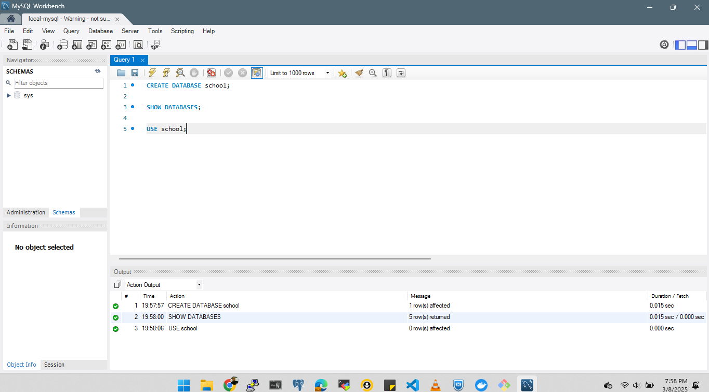

# Create a Docker Volume
A Docker volume ensures that MySQL data persists even after the container is removed.

docker volume create mysql_data

# Run MySQL Container with Persistent Storage
Use the following command to start a MySQL container using the created volume:

docker run -d \
  --name mysql_container \
  -e MYSQL_ROOT_PASSWORD=my-secret-password \
  -e MYSQL_DATABASE=mydb \
  -e MYSQL_USER=myuser \
  -e MYSQL_PASSWORD=mypassword \
  -v mysql_data:/var/lib/mysql \
  -p 3306:3306 \
  mysql:latest

# Verify Running Container
Check if the MySQL container is running:

docker ps

# Connect to MySQL
To access MySQL inside the container:

docker exec -it mysql_container mysql -u root -p

# Check Volume Persistence
Even if the container is removed, the data remains in the volume:

docker rm -f mysql_container
docker run -d \
  --name mysql_container \
  -e MYSQL_ROOT_PASSWORD=my-secret-password \
  -e MYSQL_DATABASE=mydb \
  -e MYSQL_USER=myuser \
  -e MYSQL_PASSWORD=mypassword \
  -v mysql_data:/var/lib/mysql \
  -p 3306:3306 \
  mysql:latest

The data will still be available because it’s stored in the mysql_data volume.

# Alternative: Using a Bind Mount
If you need better portability and management, use Docker Volumes. If you want direct control over data storage, use a bind mount.

If you prefer storing MySQL data in a specific directory on your host machine:

docker run -d \
  --name mysql_container \
  -e MYSQL_ROOT_PASSWORD=my-secret-password \
  -e MYSQL_DATABASE=mydb \
  -e MYSQL_USER=myuser \
  -e MYSQL_PASSWORD=mypassword \
  -v /path/to/mysql_data:/var/lib/mysql \
  -p 3306:3306 \
  mysql:latest

  # For ME (Windows)

docker run -p 3307:3306 --name my-mysql 

$ docker exec -it my-mysql bash

bash-5.1# mysql -u root -p -A
Enter password:

Welcome to the MySQL monitor.  Commands end with ; or \g.
Your MySQL connection id is 9
Server version: 9.2.0 MySQL Community Server - GPL

Copyright (c) 2000, 2025, Oracle and/or its affiliates.

Oracle is a registered trademark of Oracle Corporation and/or its
affiliates. Other names may be trademarks of their respective
owners.

Type 'help;' or '\h' for help. Type '\c' to clear the current input statement.

mysql> select user,host from mysql.user;
+------------------+-----------+
| user             | host      |
+------------------+-----------+
| root             | %         |
| mysql.infoschema | localhost |
| mysql.session    | localhost |
| mysql.sys        | localhost |
| root             | localhost |
+------------------+-----------+
5 rows in set (0.00 sec)

mysql>
---------------------------------------------------------------------------------

# For DBMS (MySQL Workbench)

My mySQL docker container is running locally:

IP: 127.0.0.1
Port: 3307
User: root
Password: root

