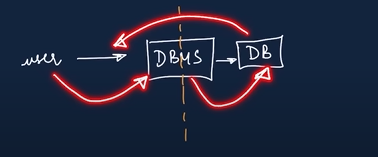
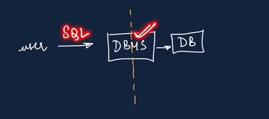

# database

Database is collection of data in a format that can be easily accessed (Digital).

A software/tool application used to manage our DB is called DBMS (# Database management syatem)

# So we actually use SQL to interact with DBMS!! And in extend we also called it RDBMS.

# Types

- We have two types of database.

1) Relational (SQL Like MySQL,PostgreSQL, Oracle)
- Data Stored in tables.
2) Non-relational (NoSQL Like mongoDB)
- Data not stored in tables.

- We use SQL to work with relational DBMS.

# SQL - Structured Query Language

SQL is a programming language used to interact with relational databases.

It is used to perform CRUD operations.

Create
Read
Update
Delete

